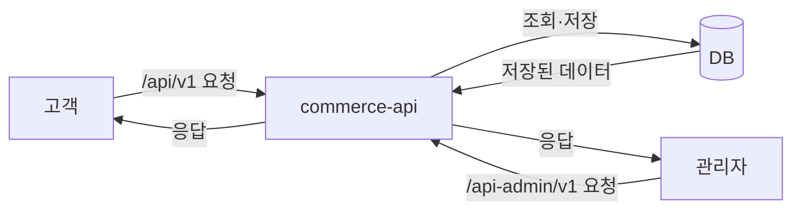
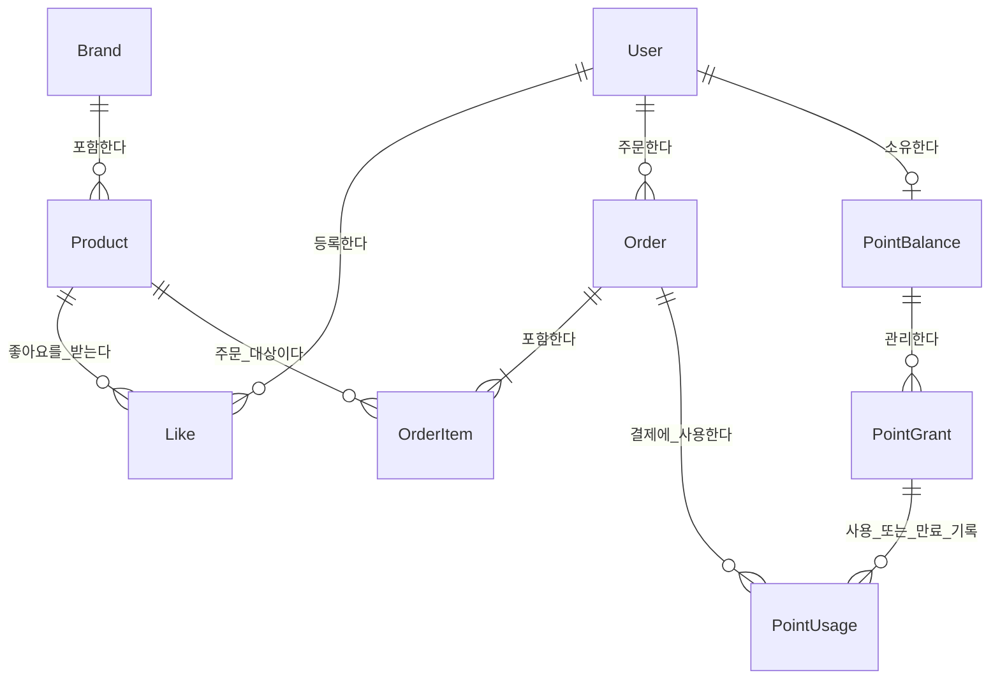
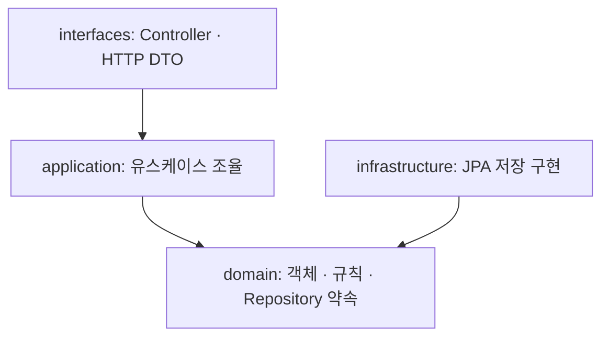
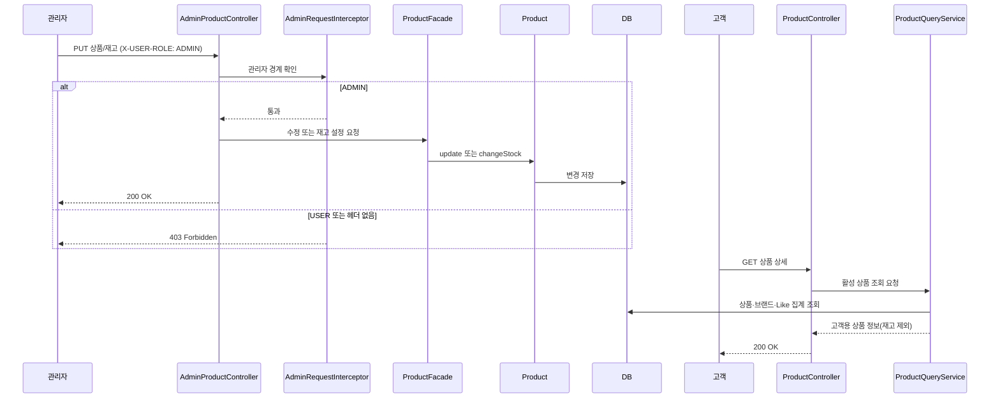
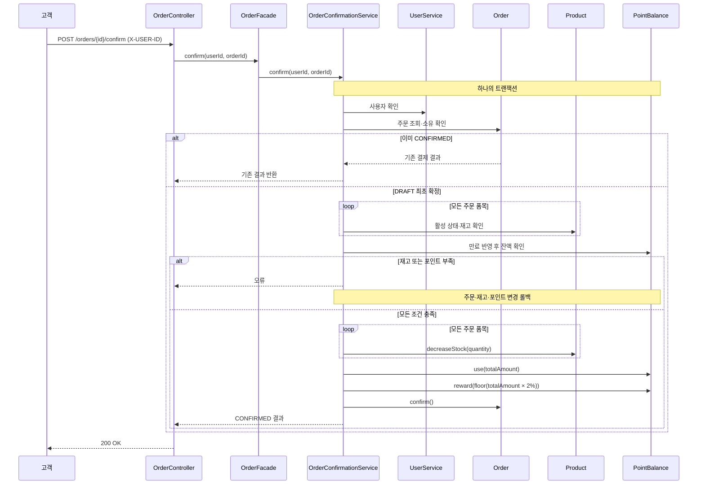

# 상품·주문·포인트 서비스 설계

## 1. 목적과 범위

고객은 브랜드·상품을 조회하고 좋아요를 관리하며, 충전한 포인트로 여러 상품의 주문을 생성·확정한다. 관리자는 브랜드·상품·재고를 관리하고 고객 주문을 조회한다.

| 구분           | 범위                                                                                           |
| -------------- | ---------------------------------------------------------------------------------------------- |
| 과제 기본 기능 | 고객 브랜드·상품 조회, 좋아요, 충전·잔액, 주문 생성·확정·조회, 관리자 CRUD·재고 변경·주문 조회 |
| 이번 확장      | 결제액 2% 즉시 적립, 적립분 1년 만료, 만료 임박 순 사용, 지급 건별 사용·만료 기록              |
| 이후 확장      | 주문 취소·재고 복구·포인트 복원·적립금 회수                                                    |
| 이번 제외      | 쿠폰, 장바구니 API, 주문 TTL, 동시성 처리                                                      |

완료된 요청의 순차 재요청은 처리한다. 동시 요청에 대한 락·충돌 제어를 보장한다는 의미는 아니다.

**확정(Q01):** 기본 주문 계약 위에 2% 즉시 적립을 확장한다. 잔액 0원에서 10,000원을 충전하고 7,000원을 결제하면 140포인트가 적립되어 최종 잔액은 **3,140원**이다. `floor(결제액 × 2 / 100)`이 0이면 지급 건을 만들지 않는다.

## 2. 버드뷰와 요청자 경계



- 하나의 API 서버와 DB에서 시작한다. 포인트 만료를 위한 별도 배치 서버는 이번에 도입하지 않는다.
- 고객의 좋아요·포인트·주문은 요청자로 식별한 사용자 범위에 한정한다. 식별 누락·없는 사용자·다른 사용자 접근을 거절한다.
- 1주차 문서에는 `X-USER-ID`가 있다. 실제 fixture와의 연결, 고객 조회 API별 식별 적용 범위와 오류 매핑은 Q02에서 구체화한다.
- Spring Security는 사용하지 않는다. `AdminRequestInterceptor`가 `/api-admin/**`에서 로컬 전용 `X-USER-ROLE: ADMIN` 헤더를 검사하며, 누락·다른 역할은 403으로 거절한다. 고객 요청자는 기존 `X-USER-ID`로 식별한다.
- 로컬 실습은 `server.address=127.0.0.1`로 제한한다. 실제 비밀정보·개인정보나 공개 배포는 사용하지 않는다.

## 3. 도메인 관계와 책임

### 3.1 업무 관계



`A ||--o{ B : 관계명`은 A 하나에 B가 0개 이상 연결되고, 각 B는 A 하나에 연결된다는 뜻이다. `||`는 정확히 1개, `o{`는 0개 이상, `|{`는 1개 이상, `o|`는 0개 또는 1개다. 콜론 뒤 이름은 관계를 설명하는 문구이며 메서드나 컬럼 이름이 아니다.

위 선은 업무 관계를 표현하며, JPA의 양방향 참조나 테이블 분할을 확정하는 것은 아니다.

- `PointUsage`는 `PAYMENT` 또는 `EXPIRATION` 타입을 가진다. 만료를 별도 엔티티로 만들지 않고 같은 사용 기록으로 보존한다.
- `PointBalance → PointGrant → PointUsage`는 각각 소유 외래 키로 저장한다. 조인 테이블을 만들지 않아 Aggregate 소유 경계와 DB 관계가 같다.

### 3.2 Aggregate

```text
[Brand]          Brand Entity / Root
[Product]        Product Entity / Root
                 └─ Stock VO
[Like]           Like Entity / Root
[Order]          Order Entity / Root
                 └─ OrderItem Entity
[PointBalance]   PointBalance Entity / Root
                 ├─ PointGrant（개별 지급 건）
                 └─ 사용·만료 기록을 관리하는 변경 경계

Money: 금액을 표현하는 VO
```

포인트 관리 경계는 전체 과거 기록을 매번 로드하는 것을 뜻하지 않는다. 현재는 지급 건과 사용 기록을 함께 저장하고, 잔여액은 지급액에서 기록 합계를 빼서 계산한다.

| 객체           | 상태·책임                                                                 | 맡지 않는 일                                               |
| -------------- | ------------------------------------------------------------------------- | ---------------------------------------------------------- |
| Brand          | 이름·설명·삭제 상태, 정보 변경과 삭제 상태 전환                           | 소속 Product 전체를 직접 보유하며 조회                     |
| Product        | 상품명·가격·brandId·삭제 상태, 상품 유효성, 재고 변경 진입점              | 사용자 잔액 변경, 브랜드·좋아요 응답 조합                  |
| Stock          | 0 이상 수량, 양수 차감·재고 부족 검증, 새 수량 값 반환                    | 상품 활성 상태·DB 조회                                     |
| Like           | 사용자–상품 관계와 등록 시각                                              | Product의 카운터 증감                                      |
| Order          | 소유자·품목·상태·합계·결제 결과, 주문 유효성·확정                         | 현재 상품 가격으로 과거 주문 재계산, 포인트 내부 사용 순서 |
| OrderItem      | 주문 안의 특정 품목 식별, 상품 ID·당시 이름·단가·수량, 품목 금액          | 독립적으로 주문 규칙을 우회하는 변경                       |
| Money          | 비음수 원 단위 금액, 값 동등성·유효한 연산                                | 충전 양수·상품 가격 양수 등 모든 문맥의 규칙               |
| PointBalance   | 전체 잔액, 충전·결제·만료·사용 출처 결정·2% 적립 계산, 기록과 잔액의 일치 | Repository·HTTP 응답 코드                                  |
| Point          | 식별 가능한 충전/적립 지급 사실, 지급액·시각·만료 정보·적립 원인          | 수정되는 remainingAmount 저장                              |
| 사용·만료 기록 | 원천 지급 건별 사용액과 소멸액 보존                                       | 별도의 외부 변경 진입점                                    |

Entity는 상태가 변해도 같은 대상을 추적하는 모델이고, VO는 값의 동등성으로 판단한다. Aggregate는 그 객체들의 변경과 일관성을 관리하는 경계다. 별도 책임이 있다는 사실만으로 별도 Aggregate가 되지는 않는다.

## 4. 구조와 의존



| 계층           | 역할                                                           | 금지할 직접 의존                        |
| -------------- | -------------------------------------------------------------- | --------------------------------------- |
| interfaces     | 입력 파싱·응답 변환·오류 HTTP 매핑                             | infrastructure                          |
| application    | 요청자 범위 확인 조율, 모델 조회·행동·저장·결과 조합, 트랜잭션 | interfaces DTO, infrastructure 구현     |
| domain         | 상태와 행동, 저장에 필요한 Repository 약속                     | interfaces, application, infrastructure |
| infrastructure | Repository 약속을 JPA로 구현                                   | HTTP 정책·업무 규칙 재구현              |

이 의존 규칙은 기존 MD의 DIP·계층 설계와 과제의 ArchUnit 예시에서 가져왔다. 화살표는 HTTP 요청의 이동이 아니라 소스 코드가 어떤 타입을 참조하는지 나타낸다. application은 domain의 Repository 인터페이스를 알고, infrastructure는 그 인터페이스를 구현한다. 따라서 런타임에는 저장 구현이 호출되어도 application이 JPA 구현 클래스를 직접 알아야 하는 것은 아니다. 표는 모든 가능한 의존을 열거한 것이 아니라 과제가 검사하도록 제시한 핵심 금지 방향이다.

패키지는 starter의 `com.loopers.interfaces/application/domain/infrastructure`를 유지하고 계층 아래에 기능을 배치한다. Java 21과 기존 Gradle·Spring Boot 버전을 사용한다. 기존 MD의 Prisma 예시는 JPA 구현으로 바꾸되 의존 방향은 유지한다.

`BrandRepository`, `ProductRepository`, `LikeRepository`, `OrderRepository`, `PointBalanceRepository`는 Root 기준의 약속이다. 별도 Stock/OrderItem 변경 Repository는 두지 않는다. 구체적인 메서드·기록 조회/저장 매핑은 구현 전에 정한다. 조회 전용 projection은 HTTP DTO와 구분한다.

실행 시 application이 호출하는 대상은 JPA 구현체일 수 있지만, 소스는 domain의 인터페이스에 의존한다. 모델이 Repository를 직접 호출할 필요는 없다. JPA annotation 사용 여부·도메인과 저장 모델 분리 여부는 Q07이며, VO와 테이블을 일대일로 대응시키지 않는다.

## 5. 업무 규칙

### 5.1 상품·브랜드·좋아요

- **CAT-01:** 상품명은 앞뒤 공백 제거 후 1~100 Unicode 코드 포인트이며 공백만 입력할 수 없다. 가격은 `long` 양수, 초기 재고는 필수 `int` 0 이상이다.
- **BRAND-01:** 삭제되지 않은 브랜드끼리는 같은 이름을 허용하지 않는다. 등록 시 활성 브랜드와 중복되면 거절하며, 이름 수정 시에는 자기 자신을 제외한 활성 브랜드와 중복되는지 확인한다. 삭제된 브랜드와 같은 이름으로 새 브랜드를 등록할 수 있으며 새 ID를 부여한다. 기존 브랜드를 복원하거나 기존 참조를 새 브랜드로 옮기지 않는다.
- **BRAND-02:** 이름의 앞뒤 공백을 제거해 저장하고, 중복 비교에서는 영문 대소문자를 무시한다. 표시 이름의 영문 대소문자는 입력대로 유지한다. 내부 공백은 구분한다. 따라서 `Nike`와 `NIKE`는 중복이고, `AB`와 `A B`는 다른 이름이다. 등록과 이름 수정에 같은 기준을 적용한다.
- **BRAND-03:** 이름은 필수이며 앞뒤 공백 제거 후 1~100자다. 누락·null·공백만 있는 이름과 100자를 초과하는 이름을 거절한다. 설명은 선택이며 최대 1,000자다. 설명 생략·null·공백만 입력은 모두 null로 통일한다. 내용이 있는 설명은 입력 그대로 보존한다. 길이는 Unicode 코드 포인트 수로 계산한다(예: 😀는 1자). 이름 공백 처리는 Java strip/isBlank 기준이다. 길이 제한과 표현 방식은 사용자와 합의한 정책이다.
- **CAT-02:** 상품 등록/수정은 존재하고 삭제되지 않은 브랜드를 참조한다. 수정 시 기존 브랜드를 유지한다.
- **CAT-03:** 재고는 0 이상. 관리자는 최종 수량을 설정하며 차감량은 양수여야 한다.
- **CAT-04:** 상품은 재고가 남아 있어도 `deletedAt`을 사용하는 논리 삭제가 가능하고 수량은 보존한다.
- **CAT-05:** 브랜드는 삭제되지 않은 연결 상품이 있으면 삭제 불가. 재고 0인 상품도 포함한다. 이벤트스토밍의 브랜드 논리 삭제 방향을 따른다.
- **CAT-06:** 삭제 대상은 고객 상세/목록·새 주문·최초 확정·새 좋아요·수정/재고 변경에서 제외한다. 고객 상세는 없는 대상 오류다. 관리자 조회 범위는 Q04.
- **LIKE-01:** 사용자–상품 관계 하나로 저장한다. 좋아요 수는 관계를 집계한다.
- **LIKE-02:** POST 반복은 이미 등록된 관계 유지 후 성공, DELETE 반복은 관계 없음 상태로 성공. POST가 취소로 토글되지 않는다.
- **LIKE-03:** 삭제 상품은 내 목록에서 제외하지만 남은 자신의 좋아요 관계는 취소할 수 있다. 취소에 활성 상품 검증을 공통 적용하지 않는다. 예를 들어 고객이 삭제 전 열어둔 화면에서 알고 있는 productId로 DELETE를 보내면 관계를 취소할 수 있다. 새 목록에 삭제 상품을 노출하거나 별도 정리 화면을 만든다는 뜻은 아니다. 과제는 목록에서의 제외와 잔존 관계 취소 허용을 모두 요구한다.

| 상품 정렬     | 기준                                                  |
| ------------- | ----------------------------------------------------- |
| latest (기본) | 등록 시각 내림차순 → ID 내림차순                      |
| price_asc     | 가격 오름차순 → 등록 시각 내림차순 → ID 내림차순      |
| likes_desc    | 좋아요 수 내림차순 → 등록 시각 내림차순 → ID 내림차순 |

미지원 정렬값은 입력 오류다. 브랜드 필터의 없는/삭제 대상 처리와 페이지 규격은 Q05. 내 좋아요 목록은 최신순이며 세부 페이지 계약은 미정이다.

### 5.2 주문

- **ORD-01:** 최소 한 품목, 양수 수량. 중복 상품은 수량 합산 후 총수량 기준으로 검증한다. 합산/곱셈/합계 표현 범위 초과를 확인한다.
- **ORD-02:** 생성 시 상품 존재·삭제 상태를 확인하고 품목·당시 이름·단가·합계를 DRAFT로 저장한다. 재고 예약·차감이나 포인트 차감은 없다.
- **ORD-03:** 이후 가격이 바뀌어도 저장한 단가로 확정한다. TTL이 없으므로 오래된 DRAFT도 이 정책을 적용한다.
- **ORD-04:** 최초 확정 시 본인 소유·상태·상품 활성 여부·재고·포인트를 확인한다. 필요한 전체 조건을 확인한 후 변경하고 각 객체의 행동도 필요한 규칙을 직접 확인한다. 예를 들어 Stock의 차감 행동은 양수가 아닌 수량과 보유량 초과를 스스로 거절한다. application이 미리 확인했더라도 다른 호출자가 검증을 빠뜨린 채 잘못된 상태를 만들지 못하게 하기 위함이다. 이는 동시성 처리를 뜻하지 않는다.
- **ORD-05:** CONFIRMED인 본인 주문 재요청은 기존 결과를 반환한다. 현재 상품 삭제 여부 때문에 완료 결과를 거절하지 않으며 재차감·재적립하지 않는다.
- **ORD-06:** 주문 품목·금액·상태·결제액·포인트 결제 결과는 저장 후 재조회 가능해야 한다. 예를 들어 주문에 저장한 티셔츠 이름·단가가 10,000원이었다면, 현재 상품을 개명하거나 12,000원으로 변경·논리 삭제해도 주문에 복사해 저장한 당시 정보는 유지한다. 이 복사된 주문 당시 정보를 스냅샷이라고 부른다.
- **ORD-07:** 고객은 자신의 주문만 조회하고 관리자는 구매자별 주문을 조회한다. 내 주문 목록은 최신순. 5년 조회 제한의 이번 반영은 Q04.

### 5.3 포인트

- **PT-01:** 1포인트=1원. 충전은 양의 정수, 1회 최대 5,000,000원. 누락·잘못된 타입·표현 범위 초과를 거절한다. 합산 범위도 검사한다.
- **PT-02:** 전체 잔액은 0 이상으로 저장한다. 충전 포인트는 만료하지 않는다.
- **PT-03:** 결제액 전액을 사용한다. 지급 건별 사용 순서는 만료일 빠른 순 → 지급 시각 빠른 순 → 지급 건 ID 순. 만료 없는 충전분은 뒤에 사용한다.
- **PT-04:** 지급액은 보존하고 사용·만료 기록을 추가한다. 지급 건별 남은 금액은 `지급액 − 누적 사용액 − 누적 만료액`으로 계산한다. 별도 remainingAmount 컬럼을 전제하지 않는다.
- **PT-05:** 최초 결제 후 `floor(결제액 × 2 / 100)`을 적립한다. 계산 중 overflow도 방지해야 한다. PointBalance가 계산·지급·잔액 변경을 담당하고 이번 적립분을 같은 결제에 선사용하지 않는다.
- **PT-06:** 적립분은 지급 시각 기준 정확히 1년 후 만료된다. 예를 들어 2026-09-17 14:30 지급분은 2027-09-17 14:30부터 사용할 수 없다.
- **PT-07:** 잔액 조회·충전·최초 결제 시 만료분을 반영한다. 미사용분만 한 번 소멸시키며 만료 기록·전체 잔액을 갱신한다. GET 잔액 조회도 이 저장을 유발할 수 있다.
- **PT-08:** 요청이 없으면 저장 잔액에 미처리 만료분이 남을 수 있다. 응답/결제 판단 시에는 만료 처리 후 사용 가능한 지급 건 합계와 전체 잔액이 일치해야 한다.
- **PT-09:** 순차 재조회/재요청으로 동일한 만료·적립 효과를 반복하지 않는다. 기록 저장과 잔액 갱신이 어긋나지 않아야 한다.

주문 확정 실패 시에는 포인트 사용·재고 차감·만료 반영을 함께 롤백한다. 이후 잔액 조회나 결제 요청에서 만료를 다시 반영한다. 이는 만료 포인트의 사용을 허용한다는 뜻이 아니다.

## 6. 대표 흐름

### 6.1 관리자 변경 → 고객 조회

1. 관리자 접근을 검증한다.
2. application이 상품과 필요한 브랜드 정보를 조회한다.
3. Product에 정보 수정 또는 재고 설정을 요청한다. 삭제 상태는 Product, 수량은 Stock이 검증한다.
4. 저장한다.
5. 고객 조회 application이 활성 상품·브랜드·좋아요 수를 조회하고 응답으로 조합한다.

상품의 응답 구성 책임은 Product에 넣지 않는다. 브랜드 삭제 시에는 application이 삭제되지 않은 연결 상품 존재 여부를 조회하고 삭제 조건 검증과 상태 전환을 조율한다.



### 6.2 좋아요 등록·취소

등록은 사용자 식별 → 활성 상품 확인 → 기존 관계 확인 → 없으면 생성 → 저장 → 성공이다. 기존 관계가 있으면 추가 생성 없이 성공한다.

취소는 사용자 식별 → 자신의 관계 확인 → 있으면 제거 → 저장 → 성공이다. 삭제 상품의 관계도 제거 가능하며, 이미 없으면 성공한다. 물리적으로 존재하지 않는 상품 ID에 대한 상세 오류 처리와 관계 저장 제약은 Q02/Q07에서 정한다.

### 6.3 포인트 충전

Mermaid 지원 여부와 관계없이 읽을 수 있도록 각 요청을 순서표로 나눴다.

| 순서 | 담당                   | 하는 일                                                   |
| ---- | ---------------------- | --------------------------------------------------------- |
| 1    | interfaces/application | 요청자와 충전액을 확인하고 필요한 계정·기록 조회          |
| 2    | PointBalance           | 만료분 반영, 충전액·합산 범위 검증, 잔액과 지급 기록 생성 |
| 3    | application/repository | 잔액과 기록을 저장하고 충전 후 잔액 반환                  |

### 6.4 주문 생성

| 순서 | 담당                   | 하는 일                                                      |
| ---- | ---------------------- | ------------------------------------------------------------ |
| 1    | interfaces/application | 사용자와 상품 ID·수량 목록을 받고 활성 상품 조회             |
| 2    | Order/OrderItem        | 중복 수량 합산·유효성 검증, 당시 이름·단가·합계로 DRAFT 구성 |
| 3    | application/repository | 주문 저장·응답. 재고·포인트는 차감하지 않음                  |

### 6.5 주문 확정

| 순서 | 담당                       | 하는 일                                                            |
| ---- | -------------------------- | ------------------------------------------------------------------ |
| 1    | application/Order          | 주문 조회, 소유자 확인. 이미 CONFIRMED면 기존 결과 반환            |
| 2    | application                | 최초 확정에 필요한 상품·계정·포인트 기록 조회                      |
| 3    | Order/Product/PointBalance | 주문 상태, 상품 활성·전체 필요 재고, 만료 반영 후 사용 가능액 검증 |
| 4    | Product/Stock              | 재고 차감                                                          |
| 5    | PointBalance               | 저장된 주문 금액 결제, 지급 건별 사용 기록 생성, 2% 적립           |
| 6    | Order                      | 결제 결과 반영, CONFIRMED 전환                                     |
| 7    | application/repository     | 변경사항을 함께 저장하고 응답                                      |



### 6.6 주문·잔액 조회

| 요청         | 흐름                                                                       |
| ------------ | -------------------------------------------------------------------------- |
| 내 주문 조회 | 요청자 확인 → 본인 주문 조회 → 저장된 품목·단가·결제 결과 반환             |
| 내 잔액 조회 | 요청자 확인 → 계정·필요 기록 조회 → 만료분 반영·저장 → 사용 가능 잔액 반환 |

여러 품목에서 마지막 품목이 부족하거나 결제액이 부족하면 주문 확정·결제 차감·재고 차감·적립이 일부만 저장돼서는 안 된다. application이 트랜잭션을 조율한다. DB rollback과 메모리 객체 상태 복구는 같은 것이 아니므로 테스트 경계를 구분한다. 동시성 제어는 이번 범위 밖이다.

## 7. API 계약

경로·method는 과제 기준이다. 응답은 기존 `ApiResponse<T>` 외형을 사용하며, 생성은 201, 삭제는 204, 일반 조회·수정·주문 확정은 200이다.

기존 starter의 `ApiResponse<T>`는 `meta(result, errorCode, message)`와 `data`를 제공한다. 이 외형을 참고하되, 오류 매핑을 domain에 넣지 않는다. 1주차의 남의 주문/없는 주문 동일 404 방침은 이번 계약에 연결할 후보이며 전체 API에 자동 확장하지 않는다.

### 7.1 고객

| Method / Path                             | 입력                                  | 성공 의미                                      | 대표 오류                                       | 규칙                |
| ----------------------------------------- | ------------------------------------- | ---------------------------------------------- | ----------------------------------------------- | ------------------- |
| GET /api/v1/brands/{brandId}              | 브랜드 ID                             | 활성 브랜드 정보                               | 없음/삭제 대상, ID 형식 오류                    | CAT-06              |
| GET /api/v1/products                      | 브랜드 필터·페이지·정렬               | 활성 상품 목록, 브랜드 정보·좋아요 수          | 미지원 정렬, 잘못된 입력; 필터 세부 Q05         | CAT-06, LIKE-01     |
| GET /api/v1/products/{productId}          | 상품 ID                               | 상품·브랜드 정보·좋아요 수                     | 없음/삭제 대상, ID 형식 오류                    | CAT-06              |
| POST /api/v1/products/{productId}/likes   | 요청자, 상품 ID                       | 등록된 관계 유지                               | 식별 오류, 없음/삭제 상품                       | LIKE-01~02          |
| DELETE /api/v1/products/{productId}/likes | 요청자, 상품 ID                       | 자신의 관계 없음                               | 식별·입력 오류; 없는 상품 계약 Q02              | LIKE-02~03          |
| GET /api/v1/users/{userId}/likes          | 요청자, 대상 사용자 ID, 목록 조건 Q05 | 자신의 활성 상품 좋아요 목록                   | 식별/다른 사용자 접근, 입력 오류                | LIKE-03             |
| POST /api/v1/points/charge                | 요청자, amount                        | 충전액 저장, 만료 반영 후 잔액 반환            | 누락/타입/양수/한도/합산 범위, 식별 오류        | PT-01~02, PT-07     |
| GET /api/v1/points                        | 요청자                                | 만료 반영 후 저장된 사용 가능 잔액             | 식별 오류                                       | PT-07~08            |
| POST /api/v1/orders                       | 요청자, 상품 ID·수량 목록             | DRAFT·품목·단가·합계 저장, 차감 없음           | 빈 품목, 잘못된 수량, 없음/삭제 상품, 계산 범위 | ORD-01~02           |
| POST /api/v1/orders/{orderId}/confirm     | 요청자, 주문 ID                       | CONFIRMED·결제액·결제 결과; 재요청은 기존 결과 | 식별/소유/없는 주문, 상품 삭제, 재고·잔액 부족  | ORD-03~06, PT-03~09 |
| GET /api/v1/orders                        | 요청자, 목록 조건 Q05                 | 내 주문 품목·수량·금액·상태·결제액             | 식별·목록 입력 오류                             | ORD-07              |
| GET /api/v1/orders/{orderId}              | 요청자, 주문 ID                       | 내 주문 상세와 저장된 결제 결과                | 식별/소유/없는 주문, 입력 오류                  | ORD-06~07           |

### 7.2 관리자

모든 관리자 API의 공통 대표 오류는 일반 사용자·미식별 요청의 **403**이다. 아래 표에는 기능별 오류를 추가한다.

| Method / Path                                | 입력                                     | 성공 의미                              | 대표 오류                                               |
| -------------------------------------------- | ---------------------------------------- | -------------------------------------- | ------------------------------------------------------- |
| GET /api-admin/v1/brands                     | 목록 조건 Q05                            | 브랜드 목록                            | 잘못된 목록 입력                                        |
| POST /api-admin/v1/brands                    | 브랜드 이름·선택 설명                    | 새 ID의 브랜드 생성·저장               | 유효하지 않은 브랜드 정보(Q03), 활성 브랜드 이름 중복   |
| GET /api-admin/v1/brands/{brandId}           | 브랜드 ID                                | 관리자 브랜드 상세                     | 없는 대상; 삭제 대상 Q04                                |
| PUT /api-admin/v1/brands/{brandId}           | ID, 변경 정보 Q03                        | 브랜드 수정·저장                       | 없음/삭제 대상, 유효성 오류, 다른 활성 브랜드 이름 중복 |
| DELETE /api-admin/v1/brands/{brandId}        | 브랜드 ID                                | 삭제 상태 저장                         | 활성 소속 상품 존재; 재삭제 Q04                         |
| GET /api-admin/v1/products                   | 목록 조건 Q05                            | 상품 목록                              | 잘못된 목록 입력                                        |
| POST /api-admin/v1/products                  | 브랜드 ID, 이름·가격, 초기 재고 계약 Q03 | 상품 생성·저장                         | 없음/삭제 브랜드, 이름·가격·재고 오류                   |
| GET /api-admin/v1/products/{productId}       | 상품 ID                                  | 관리자 상품 상세                       | 없는 대상; 삭제 대상 Q04                                |
| PUT /api-admin/v1/products/{productId}       | ID, 이름·가격 등 수정 필드 Q03           | 기존 브랜드를 유지한 수정              | 없음/삭제 상품·브랜드, 유효성 오류                      |
| DELETE /api-admin/v1/products/{productId}    | 상품 ID                                  | 재고를 보존한 논리 삭제                | 없는 대상; 재삭제 Q04                                   |
| PUT /api-admin/v1/products/{productId}/stock | 상품 ID, 최종 수량                       | 0 이상 재고 저장                       | 없음/삭제 상품, 음수/잘못된 타입/범위                   |
| GET /api-admin/v1/orders                     | 구매자 필터·목록 조건 Q05                | 구매자별 주문·품목·상태·금액·결제 결과 | 잘못된 조회 조건                                        |
| GET /api-admin/v1/orders/{orderId}           | 주문 ID                                  | 구매자 정보가 포함된 주문 상세         | 없는 주문, 입력 오류                                    |

고객 주문 조회는 본인 범위, 관리자 조회는 구매자 식별이 필요한 범위다. 관리자 삭제 상태·운영 필드와 고객 노출 필드의 정확한 목록은 Q02/Q04에 남긴다. 브랜드 상세에 소속 상품까지 내장할지는 미정이며 필수로 간주하지 않는다.

## 8. 테스트 기대값과 검증 계획

아래는 **작성할 테스트의 기대값**이다. 실행 결과나 TDD 완료 이력이 아니다.

| ID / 관련 규칙      | 입력·상황                                                           | 기대값                                                 | 주 검증 경계        |
| ------------------- | ------------------------------------------------------------------- | ------------------------------------------------------ | ------------------- |
| T01 / CAT-03        | 재고 5, 2 차감 / 5 차감                                             | 각각 3 / 0                                             | domain              |
| T02 / CAT-03        | 재고 5, 6 차감 / 0·음수 차감                                        | 거절, 원래 수량 5 유지                                 | domain              |
| T03 / CAT-01~03     | 공백 이름·0 가격·음수 최종 재고                                     | 거절, 기존 객체 유효 상태 유지                         | domain              |
| T04 / CAT-04~06     | 재고 5 상품 삭제, 재조회/재고 변경                                  | 수량 5 보존, 고객 조회 제외, 변경 거절                 | application·DB·HTTP |
| T05 / CAT-05        | 활성 소속 상품 재고 0, 브랜드 삭제                                  | 거절, 브랜드 상태 유지                                 | application·DB      |
| T24 / BRAND-01      | 활성 브랜드와 같은 이름으로 등록/다른 브랜드 이름 수정              | 거절, 새 브랜드 생성 및 기존 이름 변경 없음            | application·DB·HTTP |
| T25 / BRAND-01      | 삭제된 브랜드 이름으로 재등록                                       | 새 ID로 등록, 삭제된 브랜드와 기존 참조 유지           | application·DB      |
| T26 / BRAND-01      | 활성 브랜드가 자기 이름을 그대로 유지하며 수정                      | 이름 중복으로 거절하지 않음                            | application         |
| T27 / BRAND-02      | `Nike` 등록 후 저장 결과 조회                                       | 앞뒤 공백을 제거한 `Nike`로 보존, 영문 대소문자 유지   | domain·DB           |
| T28 / BRAND-01~02   | 활성 `Nike`가 있을 때 `NIKE` 또는 `Nike` 등록/다른 브랜드 이름 수정 | 중복으로 거절, 기존 값 유지                            | application·DB·HTTP |
| T29 / BRAND-02      | 활성 `AB`가 있을 때 `A B` 등록                                      | 내부 공백이 달라 이름 중복으로 거절하지 않음           | application·DB      |
| T30 / BRAND-03      | 이름 누락/null/공백만 입력                                          | 등록 거절, 브랜드 생성 없음                            | domain·HTTP         |
| T31 / BRAND-03      | 앞뒤 공백 제거 후 이름 1자/100자/101자                              | 1자와 100자는 허용, 101자는 거절                       | domain·HTTP         |
| T32 / BRAND-03      | 설명 생략/null/공백만 입력                                          | 모두 설명 없음으로 처리                                | domain·HTTP·DB      |
| T33 / BRAND-03      | 설명 1,000자/1,001자                                                | 1,000자는 허용, 1,001자는 거절                         | domain·HTTP         |
| T06 / LIKE-01~02    | 같은 사용자 상품 POST 2회, DELETE 2회                               | 관계 최대 1, 취소 후 0, 반복 성공                      | application·DB·HTTP |
| T07 / LIKE-03       | 좋아요 후 상품 삭제                                                 | 내 목록 제외, 새 등록 거절, 기존 관계 취소 가능        | HTTP·DB             |
| T08 / PT-01         | 충전 0/음수/5,000,001/누락/잘못된 타입                              | 거절, 충전 효과 없음                                   | domain·HTTP         |
| T09 / PT-01         | 만료분 없는 잔액에 1원/5,000,000원 충전                             | 각각 허용, 합산액 재조회                               | DB·HTTP             |
| T10 / PT-01         | 유효 입력끼리 합산하나 저장 표현 범위 초과                          | 거절, 충전 전 값 유지                                  | domain·HTTP         |
| T11 / ORD-01~02     | 같은 상품 수량 2+3으로 생성                                         | 총 5개로 합산, DRAFT, 재고/포인트 차감 없음            | domain·DB           |
| T12 / ORD-03        | 단가 10,000 ×2 생성 후 현재 가격 12,000                             | 기존 주문 20,000 결제                                  | application·DB      |
| T13 / ORD-04        | 여러 품목 중 뒤 품목 재고 부족                                      | 전체 주문 확정 효과 없음                               | application·DB      |
| T14 / ORD-05        | CONFIRMED 주문에 순차 재요청                                        | 기존 결과, 재차감 없음                                 | HTTP·DB             |
| T19 / ORD-06        | 주문 저장 후 상품 가격 변경·삭제                                    | 주문 당시 이름·단가·결제 결과 보존                     | DB                  |
| T20 / 접근 경계     | 타인의 주문/좋아요 접근, 식별 누락·없는 사용자                      | 거절, 대상 변경 없음; 구체 응답 Q02                    | application·HTTP    |
| T21 / 관리자        | ADMIN / USER / 미식별 요청                                          | ADMIN 허용, 나머지 403                                 | 실제 MockMvc·DB     |
| T22 / 정렬          | 가격/좋아요/등록 시각 동률 데이터                                   | 정의한 보조 정렬까지 적용                              | repository          |
| T23 / 통합 흐름     | 잔액0→10,000 충전→2,000×2+3,000×1 주문 확정                         | 결제7,000, 140 적립 후 최종3,140 및 품목/재고 재조회   | HTTP·DB             |
| T34 / PT-06~09      | 만료된 500 적립금과 만료 없는 1,000 충전금 조회를 두 번 실행        | 첫 조회에서 500만 소멸·저장, 두 번째 조회도 1,000 유지 | DB 통합             |
| T35 / ORD-04, PT-07 | 만료 처리 후 잔액 부족으로 주문 확정 실패                           | 주문 DRAFT, 재고·저장 잔액 모두 실패 전 상태 유지      | DB 통합             |
| T36 / 관리자 경계   | 실제 MockMvc·DB에서 ADMIN/USER/헤더 없음으로 브랜드 요청            | ADMIN만 조회·생성 가능, 나머지 403                     | HTTP·DB 통합        |

적립·만료 확장은 T34~T35로 별도 검증한다.

### TDD와 도구 적용 계획

1. 첫 기능의 계약·기대값을 확인하고 AI 작업 규칙을 정리한다. Checkstyle 10.26.1의 AvoidStarImport/UnusedImports, 표준 ArchUnit 1.5.0을 기존 JUnit에 연결한다. domain/application/interfaces의 금지 의존을 실제 구현 클래스에 검사한다.
2. Brand 등록·조회부터 모델·저장·API를 연결한다. 기능 구현 순서는 아래 계획을 따른다.
3. Product 재고 변경 단계에서 Stock 정상 차감·초과 차감 후 원래 값 유지 테스트를 대표 TDD 사례로 작성한다. 컴파일/DB 장애가 아니라 해당 규칙 때문에 실패하는 Red를 확인한다.
4. 최소 구현으로 Green을 확인하고, 책임·중복을 정리한 뒤 다시 실행한다. Stock TDD를 위해 해당 차감 행동을 먼저 완성해 두지 않는다.
5. domain은 interfaces/application/infrastructure에 의존하지 않고, application은 fake로 협력을 검증한다. 현재 starter 구조에서는 JPA·Spring 어노테이션을 모델과 서비스에 유지한다. JPA 저장 테스트는 flush/clear 후 재조회한다.
6. 관리자 MockMvc는 실제 controller/application/repository·테스트 DB로 관리자 허용·일반/미식별 거절을 확인한다. Spring Security를 제외한 식별/접근 검사와 테스트 입력 방식은 Q10에서 정한다. 과제가 지정한 Security 설정·security-test·CSRF 테스트 방식과 다르다는 점을 기록한다.

설정 후 실행할 명령:

```bash
./gradlew :apps:commerce-api:test --tests '*Stock*Test'
./gradlew :apps:commerce-api:test --tests '*ArchitectureTest'
./gradlew :apps:commerce-api:check
```

Checkstyle 10.26.1과 ArchUnit 1.5.0을 연결했고, 계층 의존 검사를 통과했다. 작업 규칙은 저장소 루트의 `AGENTS.md`에 반영했다. 관리자 요청은 Spring Security 대신 로컬 `X-USER-ROLE: ADMIN` Interceptor로 분리하고, 실제 MockMvc·DB 통합 테스트로 ADMIN/USER/헤더 없음의 경계를 검증한다. 로컬 서버는 `server.address=127.0.0.1`로만 바인딩한다.

최종 검증은 `source ./scripts/fix-docker-testcontainers.sh` 후 `./gradlew :apps:commerce-api:check`로 실행했다. **117개 테스트, 실패 0, 오류 0, skip 0**이며 Checkstyle과 ArchUnit도 통과했다.

## 9. 설계 판단과 AI 대안 검토

| 판단             | 비교한 대안                                     | 선택과 이유                                                         | 비용·다시 검토할 조건                                                     |
| ---------------- | ----------------------------------------------- | ------------------------------------------------------------------- | ------------------------------------------------------------------------- |
| Stock 경계       | 별도 Aggregate / Product 내부 VO                | 수량 규칙은 별도 객체로 유지하되 Product를 변경 진입점으로 선택     | 독립 재고 관리 요구가 생기면 재검토. 별도 책임과 별도 Aggregate는 다름    |
| OrderItem        | 값 묶음 VO / 내부 Entity                        | 사용자는 주문의 특정 품목을 식별하는 관점을 선택. Order 내부 Entity | 식별/매핑 관리가 필요. 소속 자체가 Entity의 근거는 아님                   |
| 포인트 잔여액    | 지급 건 remainingAmount 갱신 / 기록 합산        | 전체 잔액은 저장, 지급 건 잔여는 지급·사용·만료 기록에서 계산       | 관련 기록 합산 비용·누락 방지 필요. 성능 문제가 확인되면 저장 잔여액 검토 |
| 포인트 정책 객체 | 별도 Spend/Reward 정책 / PointBalance 행동      | 현재 고정 정책은 PointBalance가 계산·변경                           | 계산이 복잡해지거나 여러 정책이 필요할 때 분리 검토                       |
| 주문 가격        | 생성 스냅샷 / 확정 재계산 / TTL                 | 생성 당시 가격 유지, TTL 없음                                       | 오래된 DRAFT에도 과거 가격 적용. 가격 보장 기간이 필요하면 재검토         |
| 상품 삭제        | 재고 0에서만 삭제 / 재고와 무관한 논리 삭제     | 판매 중단을 위해 수량을 인위적으로 0으로 만들지 않음                | 활성 상태 필터와 기존 주문 스냅샷 보존 필요                               |
| 조회 조합        | Product에 브랜드·좋아요 조회 / application 조합 | 응답 변화가 Product 규칙에 번지지 않게 application에서 조합         | 조회 조율 코드 필요. 실제 쿼리 수는 구현 시 검증                          |

AI가 제시했던 ‘규칙이 다르면 반드시 별도 Aggregate’, ‘종속되면 반드시 같은 Aggregate’, ‘VO는 숫자’, ‘불변이면 무조건 VO’는 판단 기준으로 사용하지 않는다. 기존 MD를 새로 시작한 것이 아니라 미정 항목을 결정하고 일부 경계를 수정했다.

## 10. 구현 결정과 변경 기준

### 기능 구현 순서

Stock은 외부 의존 없이 작은 규칙으로 TDD를 연습하기 좋아 첫 후보로 제안했다. 다만 사용자는 상품 등록에 필요한 브랜드부터 서비스 흐름을 이해하며 구현하기를 원했다. 이에 **Brand부터 기능을 연결하고, Stock은 Product 내부 규칙을 구현할 때 TDD로 다룬다.** 도메인 구조를 바꾼 것이 아니라 구현 순서를 정한 것이다.

| 순서 | 작업                                                                   | 완료 시 확인할 것                                      |
| ---- | ---------------------------------------------------------------------- | ------------------------------------------------------ |
| 준비 | Brand 등록·조회 계약·기대값, 필요한 요청자 구분 결정 및 개발 규칙 설정 | 관련 미정 사항 확인, 테스트·lint·ArchUnit 실행 기반    |
| 1    | Brand 등록·조회                                                        | 모델 → application → 저장 → API 연결 및 재조회         |
| 2    | Product 등록·조회                                                      | 활성 브랜드 참조·상품 유효성·고객 조회 연결            |
| 3    | Product 재고 변경과 Stock 대표 TDD                                     | 수량 설정·차감·실패 후 상태 유지                       |
| 4    | 관련 수정·삭제                                                         | 브랜드 연결 상품 삭제 조건, 상품 논리 삭제와 조회 반영 |
| 5    | 좋아요, 포인트, 주문으로 확장                                          | 기능별 계약·기대값을 먼저 정하고 통합 흐름 연결        |

Brand 삭제는 연결 상품 확인이 필요하므로 Product가 생긴 뒤 완성한다. Brand의 모든 CRUD를 완료해야 Product를 시작할 수 있다는 뜻은 아니다. 5단계 내부의 작은 작업 순서는 해당 단계에서 설명하고 정한다.

### 확정한 정책

| ID         | 결정할 내용                                                                                                                              | 필요한 시점                |
| ---------- | ---------------------------------------------------------------------------------------------------------------------------------------- | -------------------------- |
| Q01 (확정) | 2% 즉시 적립을 포함한다. 10,000원 충전·7,000원 결제 후 140원을 적립해 잔액은 3,140원이다.                                                | 구현 완료                  |
| Q02 (확정) | 고객 식별은 `X-USER-ID`로 받고, 없는 상품의 기존 좋아요 취소는 204로 허용한다. 생성은 201, 삭제는 204, 반복 좋아요 등록은 200이다.       | 구현 완료                  |
| Q03 (확정) | 상품명은 strip 후 1~100 Unicode 코드 포인트, 가격은 양수 `long`, 초기 재고는 필수 0 이상 `int`. 상품 수정 필드는 수정 API 구현 전에 확정 | 등록 입력·도메인 테스트 전 |
| Q04 (확정) | 상품·브랜드는 논리 삭제하며 재삭제는 404다. 주문 5년 조회 제한은 이번 범위에서 제외한다.                                                 | 구현 완료                  |
| Q05 (확정) | 목록은 page=0, size=20, 최대 100이며 latest·price_asc·likes_desc 보조 정렬을 적용한다.                                                   | 구현 완료                  |
| Q06 (확정) | 적립분은 지급 시각 정확히 1년 후 만료한다. 0포인트 적립은 기록하지 않는다.                                                               | 구현 완료                  |
| Q07 (확정) | PointBalance는 PointGrant와 PointUsage(PAYMENT, EXPIRATION)를 소유한다.                                                                  | 구현 완료                  |
| Q08 (확정) | 주문 확정 실패 시 재고·포인트 사용·만료 반영·주문 상태를 함께 롤백한다.                                                                  | DB 통합 테스트 완료        |
| Q09 (확정) | 실습 User는 테스트 fixture로 생성하고 PointBalance는 첫 충전/조회에서 생성한다.                                                          | 구현 완료                  |
| Q10 (확정) | `/api-admin/**`에 `X-USER-ROLE: ADMIN`을 요구하는 로컬 Interceptor를 적용한다.                                                           | 구현 완료                  |

모든 정책은 구현과 테스트에 반영했다. 변경이 생기면 먼저 이 표와 ADR을 갱신한다.
